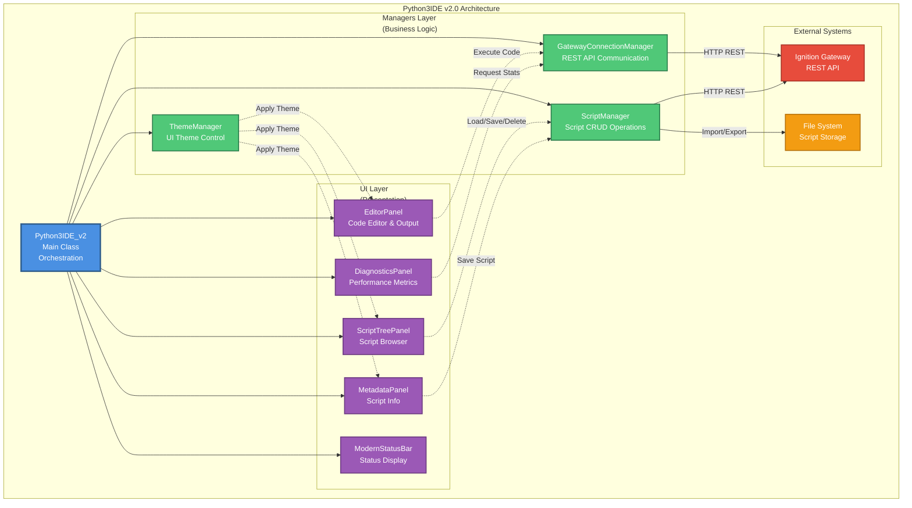
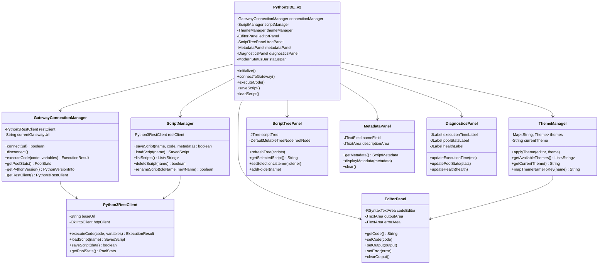
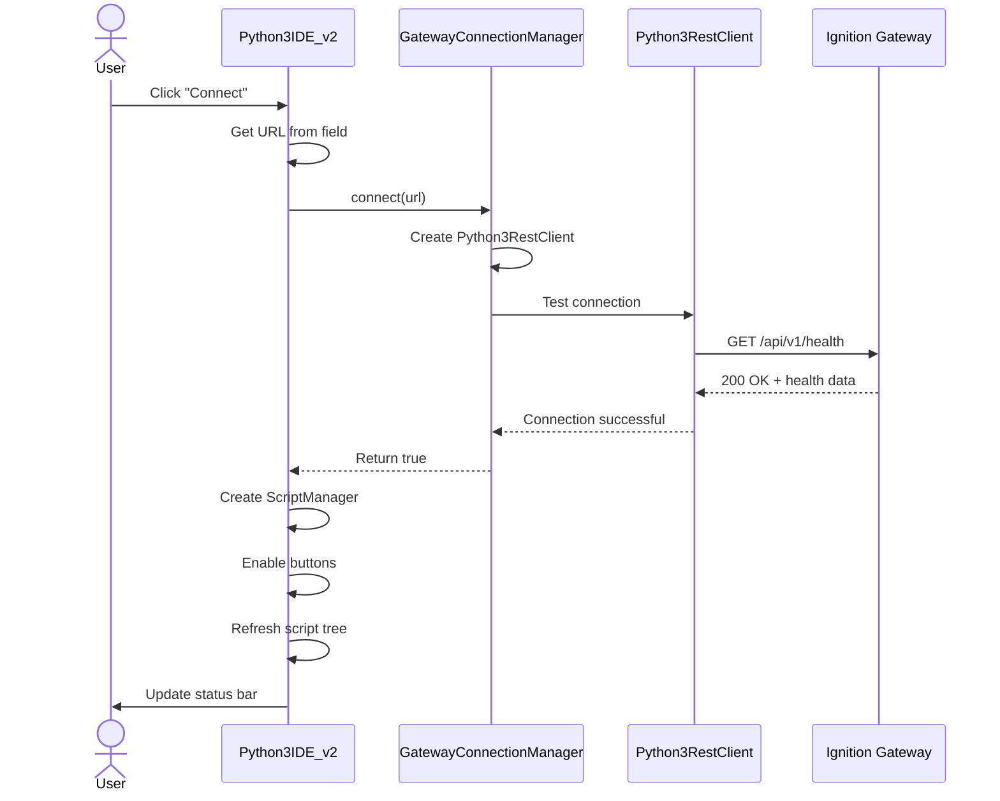
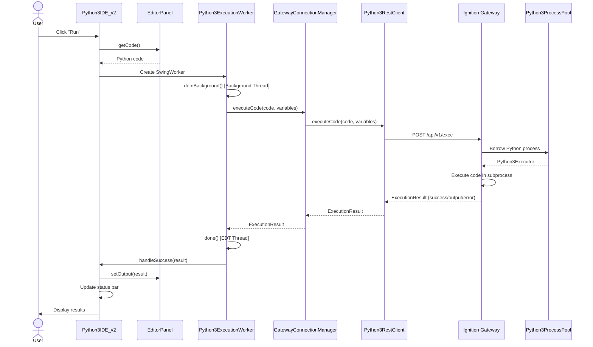
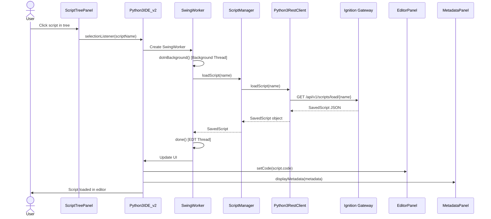
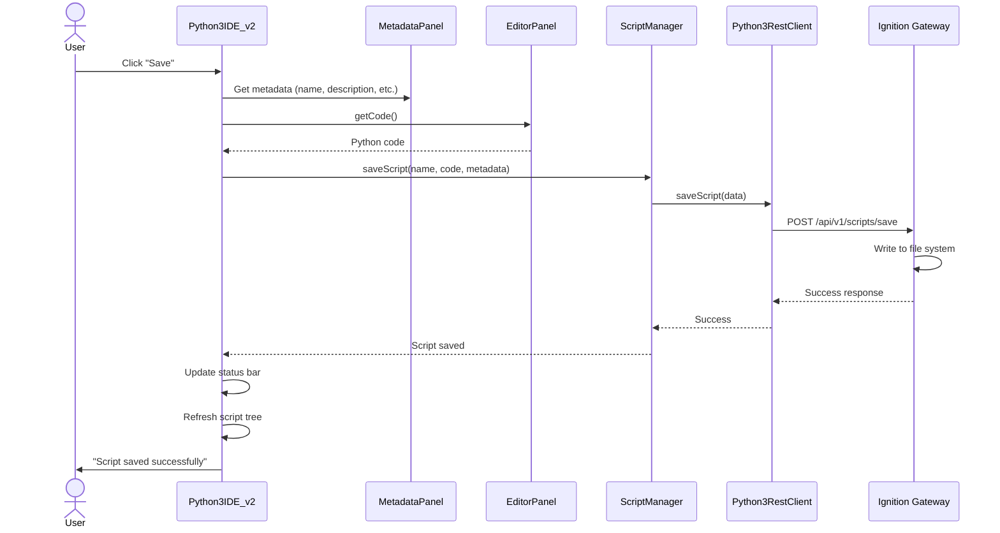

# Python3IDE v2.0 Architecture Guide

**Version:** 2.0.0+
**Last Updated:** 2025-10-17
**Author:** Claude Code

## Overview

Python3IDE v2.0 represents a complete architectural refactoring of the Python 3 IDE from the v1.9 monolith (2,676 lines) into a maintainable, modular structure with separated concerns.

### Key Benefits

- **10x Token Reduction**: Files now range from 95-440 lines (1K-4.5K tokens) vs. 25K tokens in v1.9
- **Testability**: Each component can be tested independently
- **Maintainability**: Clear separation of concerns makes changes easier
- **Extensibility**: Adding new features no longer requires navigating a 2,676-line file

### Architecture Principles

1. **Separation of Concerns**: Business logic (managers) separated from UI (panels)
2. **Single Responsibility**: Each class has one focused responsibility
3. **Dependency Injection**: Components receive dependencies via constructor
4. **Event-Driven**: UI panels communicate via callbacks/listeners

---

## Architecture Layers

```
Python3IDE_v2 (Main Class)
    │
    ├── Managers (Business Logic)
    │   ├── GatewayConnectionManager
    │   ├── ScriptManager
    │   └── ThemeManager
    │
    ├── UI Panels (Presentation)
    │   ├── EditorPanel
    │   ├── ScriptTreePanel
    │   ├── ScriptMetadataPanel
    │   ├── DiagnosticsPanel
    │   └── ModernStatusBar
    │
    └── Event Coordination
        └── Event handlers wire UI to managers
```

### Architecture Diagram



**Legend:**
- 🔵 **Blue** = Main orchestration class
- 🟢 **Green** = Business logic managers
- 🟣 **Purple** = UI presentation panels
- 🔴 **Red** = External Gateway system
- 🟡 **Yellow** = File system storage
- **Solid lines** = Direct dependencies
- **Dotted lines** = Event-driven communication

---

## Component Details

### Component Class Diagram



### 1. Managers (Business Logic)

#### GatewayConnectionManager
**File:** `designers/src/main/java/.../managers/GatewayConnectionManager.java`
**Lines:** ~110
**Responsibility:** Gateway REST API communication

**Key Methods:**
- `connect(String url)` - Establishes connection to Gateway
- `executeCode(String code, Map<String, Object> variables)` - Executes Python via REST
- `getPoolStats()` - Retrieves process pool statistics
- `getPythonVersion()` - Gets Python version information

**Dependencies:**
- `Python3RestClient` - REST API client (created on connect)

**Usage Pattern:**
```java
GatewayConnectionManager connectionManager = new GatewayConnectionManager();
boolean connected = connectionManager.connect("http://localhost:8088");

if (connected) {
    ExecutionResult result = connectionManager.executeCode("print('Hello')", new HashMap<>());
    PoolStats stats = connectionManager.getPoolStats();
}
```

---

#### ScriptManager
**File:** `designers/src/main/java/.../managers/ScriptManager.java`
**Lines:** ~105
**Responsibility:** Script CRUD operations

**Key Methods:**
- `saveScript(name, code, description, author, folderPath, version)` - Saves script to Gateway
- `loadScript(String name)` - Loads script from Gateway
- `listScripts()` - Lists all saved scripts
- `deleteScript(String name)` - Deletes script from Gateway

**Dependencies:**
- `Python3RestClient` - Communicates with Gateway REST API

**Usage Pattern:**
```java
ScriptManager scriptManager = new ScriptManager(restClient);

// Save
scriptManager.saveScript("my_script", "print('Hello')",
                         "Description", "Author", "Folder/Path", "1.0");

// Load
SavedScript script = scriptManager.loadScript("my_script");

// List
List<ScriptMetadata> scripts = scriptManager.listScripts();

// Delete
scriptManager.deleteScript("my_script");
```

**Current Limitations (v2.0.0):**
- No rename functionality (TODO)
- No folder management (TODO)
- No import/export (TODO)

---

#### ThemeManager
**File:** `designers/src/main/java/.../managers/ThemeManager.java`
**Lines:** ~220
**Responsibility:** IDE theme management

**Key Methods:**
- `applyTheme(themeName, rootComponent, codeEditor, outputArea, errorArea, scriptTree)` - Applies theme
- `mapThemeNameToKey(String displayName)` - Maps "Dark" → "dark"
- `getCurrentTheme()` - Returns current theme name
- `getSavedThemePreference()` - Gets saved preference

**Supported Themes:**
- "dark" - Dark theme
- "monokai" - Monokai theme
- "vs" - VS Code Dark+ theme

**Theme Features:**
- RSyntaxTextArea editor themes
- Dark/light UI component themes
- Scroll pane theming
- Split pane divider theming
- Dialog theming (via UIManager)

**Usage Pattern:**
```java
ThemeManager themeManager = new ThemeManager(Python3IDE_v2.class);

themeManager.applyTheme("dark",
                        this,              // root component
                        codeEditor,
                        outputArea,
                        errorArea,
                        scriptTree);

String current = themeManager.getCurrentTheme();  // "dark"
```

---

### 2. UI Panels (Presentation)

#### EditorPanel
**File:** `designers/src/main/java/.../ui/EditorPanel.java`
**Lines:** ~95
**Responsibility:** Code editor and execution results

**UI Structure:**
```
EditorPanel (BorderLayout)
    └── JSplitPane (vertical)
        ├── Top: RTextScrollPane (code editor)
        └── Bottom: JTabbedPane
            ├── Tab 1: "Output" (JScrollPane)
            └── Tab 2: "Errors" (JScrollPane)
```

**Key Methods:**
- `getCode()` - Returns editor text
- `setCode(String code)` - Sets editor text
- `setOutput(String text)` - Sets output text
- `setError(String text)` - Sets error text
- `clearOutput()` - Clears output and errors

**Usage Pattern:**
```java
EditorPanel editorPanel = new EditorPanel();

// Write code
String code = editorPanel.getCode();

// Display results
editorPanel.setOutput("Result: 42");
editorPanel.setError("SyntaxError: line 5");

// Clear
editorPanel.clearOutput();
```

---

#### ScriptTreePanel
**File:** `designers/src/main/java/.../ui/ScriptTreePanel.java`
**Lines:** ~135
**Responsibility:** Script browser tree

**UI Structure:**
```
ScriptTreePanel (BorderLayout)
    └── JScrollPane
        └── JTree
            └── Scripts (root)
                ├── Folder1
                │   ├── Script1
                │   └── Script2
                ├── Folder2/Subfolder
                │   └── Script3
                └── Script4 (root level)
```

**Key Methods:**
- `refreshTree(List<ScriptMetadata> scripts)` - Populates tree
- `setSelectionListener(Consumer<String> listener)` - Sets selection callback
- `getTree()` - Returns JTree for theming

**Usage Pattern:**
```java
ScriptTreePanel treePanel = new ScriptTreePanel();

// Set selection handler
treePanel.setSelectionListener(scriptName -> {
    System.out.println("Selected: " + scriptName);
});

// Populate tree
List<ScriptMetadata> scripts = scriptManager.listScripts();
treePanel.refreshTree(scripts);
```

**Features:**
- Hierarchical folder structure
- Automatic folder creation from `folderPath`
- Script node vs. folder node distinction

---

#### ScriptMetadataPanel
**File:** `designers/src/main/java/.../ScriptMetadataPanel.java`
**Lines:** ~195
**Responsibility:** Display script metadata

**UI Structure:**
```
ScriptMetadataPanel (BorderLayout)
    ├── North: JPanel (GridLayout 5x2)
    │   ├── Name: <name>
    │   ├── Author: <author>
    │   ├── Created: <date>
    │   ├── Modified: <date>
    │   └── Version: <version>
    └── Center: JPanel (BorderLayout)
        └── JScrollPane
            └── JTextArea (description)
```

**Key Methods:**
- `displayMetadata(ScriptMetadata metadata)` - Shows metadata
- `clear()` - Clears all fields

**UX Improvements (v2.0.1):**
- Description panel height: 70px → 120px (70% increase)
- Better scroll pane sizing for multi-line descriptions

---

#### DiagnosticsPanel
**File:** `designers/src/main/java/.../DiagnosticsPanel.java`
**Responsibility:** Real-time diagnostics display

**Displays:**
- Pool size and utilization
- Python version
- Execution metrics
- Health status

---

#### ModernStatusBar
**File:** `designers/src/main/java/.../ModernStatusBar.java`
**Responsibility:** Bottom status bar

**Features:**
- Status messages with color coding (INFO, SUCCESS, WARNING, ERROR)
- Connection status indicator
- Pool statistics display

---

### 3. Main Class (Python3IDE_v2)

**File:** `designers/src/main/java/.../Python3IDE_v2.java`
**Lines:** ~440
**Responsibility:** Assembly and event coordination

**Initialization Flow:**
```java
public Python3IDE_v2(DesignerContext context) {
    // 1. Initialize managers
    this.connectionManager = new GatewayConnectionManager();
    this.themeManager = new ThemeManager(Python3IDE_v2.class);

    // 2. Initialize UI panels
    this.editorPanel = new EditorPanel();
    this.treePanel = new ScriptTreePanel();
    this.metadataPanel = new ScriptMetadataPanel();
    this.diagnosticsPanel = new DiagnosticsPanel();
    this.statusBar = new ModernStatusBar();

    // 3. Build UI
    initComponents();        // Create buttons, fields, etc.
    layoutComponents();      // Assemble layout
    wireUpEvents();          // Connect event handlers

    // 4. Apply initial theme
    applyTheme("dark");
}
```

**Event Wiring:**
```java
private void wireUpEvents() {
    connectButton.addActionListener(e -> connectToGateway());
    executeButton.addActionListener(e -> executeCode());
    saveButton.addActionListener(e -> saveScript());
    loadButton.addActionListener(e -> loadSelectedScript());

    themeSelector.addActionListener(e -> {
        String selected = (String) themeSelector.getSelectedItem();
        if (selected != null) {
            applyTheme(themeManager.mapThemeNameToKey(selected));
        }
    });

    treePanel.setSelectionListener(this::loadScript);
}
```

**Key Event Handlers:**

1. **Connect to Gateway**
   ```java
   private void connectToGateway() {
       String url = gatewayUrlField.getText().trim();
       boolean connected = connectionManager.connect(url);

       if (connected) {
           scriptManager = new ScriptManager(connectionManager.getRestClient());
           // Enable buttons, refresh UI, etc.
       }
   }
   ```

2. **Execute Code**
   ```java
   private void executeCode() {
       String code = editorPanel.getCode().trim();

       // Create background worker
       currentWorker = new Python3ExecutionWorker(
           connectionManager.getRestClient(),
           code,
           new HashMap<>(),
           this::handleSuccess,
           this::handleError
       );

       currentWorker.execute();
   }
   ```

3. **Load Script**
   ```java
   private void loadScript(String name) {
       SwingWorker<SavedScript, Void> worker = new SwingWorker<>() {
           protected SavedScript doInBackground() {
               return scriptManager.loadScript(name);
           }

           protected void done() {
               SavedScript script = get();
               editorPanel.setCode(script.getCode());

               ScriptMetadata metadata = new ScriptMetadata();
               metadata.setName(script.getName());
               // ... populate metadata
               metadataPanel.displayMetadata(metadata);
           }
       };

       worker.execute();
   }
   ```

---

## Data Flow

### Connection Flow
```
User clicks "Connect"
    → Python3IDE_v2.connectToGateway()
        → GatewayConnectionManager.connect(url)
            → Creates Python3RestClient
            → Tests connection via /health endpoint
        ← Returns true/false
    → Creates ScriptManager with RestClient
    → Enables buttons
    → Calls refreshScriptTree()
```

### Execution Flow
```
User clicks "Run"
    → Python3IDE_v2.executeCode()
        → Gets code from EditorPanel.getCode()
        → Creates Python3ExecutionWorker (SwingWorker)
            → doInBackground()
                → GatewayConnectionManager.executeCode()
                    → Python3RestClient.executeCode()
                        → POST /api/v1/exec
                    ← ExecutionResult
            → done()
                → Python3IDE_v2.handleSuccess()
                    → EditorPanel.setOutput(result)
                    → ModernStatusBar.setStatus("Completed")
```

### Script Load Flow
```
User selects script in tree
    → ScriptTreePanel fires selectionListener
        → Python3IDE_v2.loadScript(name)
            → SwingWorker.doInBackground()
                → ScriptManager.loadScript(name)
                    → Python3RestClient.loadScript(name)
                        → GET /api/v1/scripts/load/{name}
                    ← SavedScript
            ← SavedScript
            → SwingWorker.done()
                → EditorPanel.setCode(script.getCode())
                → ScriptMetadataPanel.displayMetadata(metadata)
```

### Data Flow Sequence Diagrams

#### Connection Flow Diagram



#### Code Execution Flow Diagram



#### Script Load Flow Diagram



#### Script Save Flow Diagram



---

## Threading Model

### Event Dispatch Thread (EDT)
All UI operations must run on EDT:
- Button click handlers
- Component updates
- Layout changes

### Background Threads
Long-running operations use `SwingWorker`:
- Code execution
- Script loading/saving
- Pool statistics refresh

**Example:**
```java
SwingWorker<Result, Void> worker = new SwingWorker<>() {
    @Override
    protected Result doInBackground() {
        // Heavy work on background thread
        return expensiveOperation();
    }

    @Override
    protected void done() {
        try {
            Result result = get();
            // UI updates on EDT
            updateUI(result);
        } catch (Exception e) {
            handleError(e);
        }
    }
};

worker.execute();
```

### Threading Model Diagram

```mermaid
graph LR
    subgraph "Event Dispatch Thread (EDT)"
        UI[UI Components]
        Handler[Event Handlers]
        Update[UI Updates]
    end

    subgraph "Background Threads (SwingWorker)"
        BG1[Code Execution Worker]
        BG2[Script Load Worker]
        BG3[Script Save Worker]
        BG4[Stats Refresh Worker]
    end

    subgraph "Business Logic (Thread-Safe)"
        GCM[GatewayConnectionManager]
        SM[ScriptManager]
        Client[Python3RestClient]
    end

    subgraph "External (Network I/O)"
        Gateway[Ignition Gateway<br/>REST API]
    end

    UI -->|Click Events| Handler
    Handler -->|Create & Execute| BG1
    Handler -->|Create & Execute| BG2
    Handler -->|Create & Execute| BG3
    Handler -->|Create & Execute| BG4

    BG1 -->|doInBackground| GCM
    BG2 -->|doInBackground| SM
    BG3 -->|doInBackground| SM
    BG4 -->|doInBackground| GCM

    GCM -->|HTTP Calls| Client
    SM -->|HTTP Calls| Client
    Client -->|Network I/O| Gateway

    BG1 -->|done()| Update
    BG2 -->|done()| Update
    BG3 -->|done()| Update
    BG4 -->|done()| Update

    Update -->|Refresh| UI

    style UI fill:#9B59B6,stroke:#6C3A80,stroke-width:2px,color:#fff
    style Handler fill:#9B59B6,stroke:#6C3A80,stroke-width:2px,color:#fff
    style Update fill:#9B59B6,stroke:#6C3A80,stroke-width:2px,color:#fff
    style BG1 fill:#3498DB,stroke:#2471A3,stroke-width:2px,color:#fff
    style BG2 fill:#3498DB,stroke:#2471A3,stroke-width:2px,color:#fff
    style BG3 fill:#3498DB,stroke:#2471A3,stroke-width:2px,color:#fff
    style BG4 fill:#3498DB,stroke:#2471A3,stroke-width:2px,color:#fff
    style GCM fill:#50C878,stroke:#2E7D4E,stroke-width:2px,color:#fff
    style SM fill:#50C878,stroke:#2E7D4E,stroke-width:2px,color:#fff
    style Client fill:#50C878,stroke:#2E7D4E,stroke-width:2px,color:#fff
    style Gateway fill:#E74C3C,stroke:#A93226,stroke-width:2px,color:#fff
```

**Threading Rules:**
- 🟣 **EDT (Purple)** - All UI operations and event handlers
- 🔵 **Background Threads (Blue)** - Long-running operations via SwingWorker
- 🟢 **Business Logic (Green)** - Thread-safe, can be called from any thread
- 🔴 **External Systems (Red)** - Network I/O, blocking operations

**Key Principles:**
1. **Never block EDT** - Long operations always use SwingWorker
2. **UI updates only on EDT** - Use SwingWorker.done() for UI changes
3. **Managers are thread-safe** - Can be called from background threads
4. **Network I/O on background** - HTTP calls never on EDT

---

## Extension Points

### Adding a New Manager

1. **Create Manager Class**
   ```java
   public class MyManager {
       private final Python3RestClient restClient;

       public MyManager(Python3RestClient restClient) {
           this.restClient = restClient;
       }

       public void doSomething() {
           // Implementation
       }
   }
   ```

2. **Add to Python3IDE_v2**
   ```java
   private final MyManager myManager;

   public Python3IDE_v2(DesignerContext context) {
       // ...
       this.myManager = new MyManager(connectionManager.getRestClient());
   }
   ```

### Adding a New UI Panel

1. **Create Panel Class**
   ```java
   public class MyPanel extends JPanel {
       public MyPanel() {
           setLayout(new BorderLayout());
           // Build UI
       }

       public void updateData(Data data) {
           // Update UI
       }
   }
   ```

2. **Add to Python3IDE_v2**
   ```java
   private final MyPanel myPanel;

   public Python3IDE_v2(DesignerContext context) {
       this.myPanel = new MyPanel();
       // Add to layout
   }
   ```

---

## Testing Strategy

### Unit Testing Managers
```java
@Test
public void testScriptManager() {
    Python3RestClient mockClient = mock(Python3RestClient.class);
    when(mockClient.saveScript(...)).thenReturn(mockSavedScript);

    ScriptManager manager = new ScriptManager(mockClient);
    SavedScript result = manager.saveScript("test", "code", ...);

    assertNotNull(result);
    verify(mockClient).saveScript(...);
}
```

### Integration Testing UI
```java
@Test
public void testEditorPanel() {
    EditorPanel panel = new EditorPanel();
    panel.setCode("print('test')");

    assertEquals("print('test')", panel.getCode());
}
```

---

## Performance Considerations

### Token Efficiency
- **v1.9**: 25,000 tokens in single file
- **v2.0**: 2,500-4,500 tokens per file (10x improvement)

### Memory Usage
- Managers are singletons per IDE instance
- UI panels created once during initialization
- Background workers are short-lived

### Network I/O
- All Gateway communication is async (SwingWorker)
- REST API calls use connection pooling
- Timeouts configured at 30s

---

## Migration from v1.9

See [V2_MIGRATION_GUIDE.md](V2_MIGRATION_GUIDE.md) for detailed migration instructions.

**Quick Summary:**
- v1.9 remains fully functional (all features)
- v2.0 demonstrates architecture (core features only)
- Both versions coexist in codebase
- Gradual migration recommended

---

## Future Enhancements

### v2.1.0 (Feature Parity)
- Script rename functionality
- Folder management (create, delete, rename)
- Import/export scripts
- Find/replace in editor
- Auto-completion integration

### v2.2.0 (Advanced Features)
- Code profiling
- Historical metrics visualization
- Script dependencies tracking
- Version control integration

---

## Troubleshooting

### Common Issues

**Issue:** Managers return null
**Solution:** Ensure Gateway connection established before creating managers

**Issue:** UI not updating
**Solution:** Verify UI updates are on EDT (use `SwingUtilities.invokeLater()`)

**Issue:** Theme not applying
**Solution:** Check theme name mapping in `ThemeManager.mapThemeNameToKey()`

---

## References

- [Python3IDE_v2.java](../designer/src/main/java/com/inductiveautomation/ignition/examples/python3/designer/Python3IDE_v2.java)
- [GatewayConnectionManager.java](../designer/src/main/java/com/inductiveautomation/ignition/examples/python3/designer/managers/GatewayConnectionManager.java)
- [ScriptManager.java](../designer/src/main/java/com/inductiveautomation/ignition/examples/python3/designer/managers/ScriptManager.java)
- [ThemeManager.java](../designer/src/main/java/com/inductiveautomation/ignition/examples/python3/designer/managers/ThemeManager.java)
- [EditorPanel.java](../designer/src/main/java/com/inductiveautomation/ignition/examples/python3/designer/ui/EditorPanel.java)
- [ScriptTreePanel.java](../designer/src/main/java/com/inductiveautomation/ignition/examples/python3/designer/ui/ScriptTreePanel.java)

---

**Document Version:** 1.0
**Module Version:** 2.11.0
**Generated:** 2025-10-28 by Claude Code
